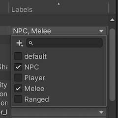
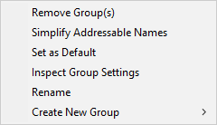

# Groups

A group is the main organizational unit of the Addressables system. Create and manage your groups and the assets they contain with the [Addressables Groups window].

You can control how Unity handles assets during a content build by organizing your Addressables into groups and assigning different settings to each group as required. See [Organizing Addressable Assets] for information about how to organize your assets.

When you initiate a content build, the build scripts create AssetBundles containing the assets in a group. The build determines the number of bundles to create and where to create them from both the [settings of the group] and your overall [Addressables system settings]. See [Builds] for more information.

> [!NOTE]
> Addressable Groups only exist in the Unity Editor. The Addressables runtime code does not use a group concept. However, you can assign a label to the assets in a group if you want to find and load all the assets that were part of that group. See __[Loading Addressable assets]__ for more information about selecting the assets to load using labels. 

## Managing groups

To manage your groups and Addressables assets, open the Addressables Groups window by going to **Window** &gt **Asset Management** &gt ** Addressables** &gt **Groups**. See [Addressables Groups window] for details about the  features of this window.

### Create a group

To create a group:

1. Open the Addressables Groups window - to **Window** &gt **Asset Management** &gt ** Addressables** and select **Groups**.
2. Select **Create** in the toolbar to open the Create menu.
3. Select **Group** &gt **Packed Asset** to create a new group. (If you have created your own [Group Templates], they are also displayed in the menu.)
4. Select the new group and right-click (mac: cmd + click) to open its context menu.
5. Select **Rename** and assign the desired name.
6. Open the context menu again and select **Inspect Group Settings**.
7. Adjust the group settings as desired.

For groups containing assets that you plan to distribute with your main application, the default settings are a reasonable starting point. For groups containing assets that you plan to distribute remotely, you must change the build and load paths to use the remote versions of the [Profile] path variables. (To build AssetBundles for remote distribution, you must also enable the __Build Remote Catalog__ option in your [Addressable System Settings].)

See [Group settings] for more information about individual settings.

## Manage assets in a group

#### Adding assets to a group

Use one of the following methods to add an asset to a group:

* Drag the assets from the Project window into the Group window and drop them into the desired group.
* Drag the assets from one group into another.
* Select the asset to open it in the Inspector window and enable the **Addressables** option. This adds the asset to the default group. Use the group context menu to change which group is the default group.
* Add the folder containing the assets to a group - all assets added to the folder are included in the group.

> [!NOTE]
> If you add assets in a Resources folder to a group, the Addressables system first moves the assets to a non-Resource location. You can move the assets elsewhere, but Addressable assets can't be stored in a Resources folder in your Project.

#### Remove assets from a group

Select one or more assets in the Groups window and right-click (macOS: cmd + click) to open the context menu, then select **Remove Addressables**. You can also select the assets and press the Delete key to remove the assets from the group.

#### Add or remove labels

Select one or more assets in the Groups window, then select the label field for one of the selected assets.

 *Assigning labels*

To assign labels, enable or disable the checkboxes for the desired labels.

To add, remove or rename your labels, select the __Plus__ button, then select __Manage Labels__. To only add a new label, select the __Plus__ button and then select __New Label__. See [Labels] for more information on how to use labels.

### Group context menu

To open the Group context menu and access group-related commands, right-click (macOS: cmd + click) on a group name.

*The Group content menu*

| Command| Action |
|:---|:---| 
| __Remove Group(s)__| Removes the Group and deletes its associated ScriptableObject asset. Unity reverts any assets in the group into non-Addressable assets.  |
| __Simplify Addressable Names__| Shortens the name of assets in the group by removing path-like components and extensions. |
| __Set as Default__| Sets the group as the default group. When you mark an asset as Addressable without explicitly assigning a group, Unity adds the asset to the default group. |
| __Inspect Group Settings__| Selects the group asset in the Unity Project window and in the Inspector window so that you can view the settings. |
| __Rename__| Enables you to edit the name of the group. |
| __Create New Group__| Creates a new group based on a group template. |

### Asset context menu

To open the Addressable Asset context menu and access asset-related commands, right-click (macOS: cmd + click) on an asset.

*Addressable Asset context menu*

| Command| Action |
|:---|:---| 
| __Move Addressables to Group__| Move the selected assets to a different, existing group. |
| __Move Addressables to New Group__| Create a new group with the same settings as the current group and move the selected assets to it. |
| __Remove Addressables__| Remove the selected asset(s) from the Group and make the asset(s) non-Addressable.  |
| __Simplify Addressable Names__| Shortens the names of the selected assets by removing path-like components and extensions. |
| __Copy Address to CLipboard__| Copies the asset's assigned address string to your system Clipboard. |
| __Change Address__| Enables you to edit the asset's name. |
| __Create New Group__| Create a new group based on a group template. This doesn't move the selected assets. |

   
[Addressable System Settings]: xref:addressables-asset-settings
[AddressableAssetGroup]: xref:UnityEditor.AddressableAssets.Settings.AddressableAssetGroup
[AddressableAssetGroupSchema]: xref:UnityEditor.AddressableAssets.Settings.AddressableAssetGroupSchema
[Addressables Groups window]: xref:addressables-groups-window
[Addressables Settings]: xref:addressables-asset-settings
[Addressables system settings]: xref:addressables-asset-settings
[Analyze]: xref:addressables-analyze-tool
[AssetBundle Compression]: xref:AssetBundles-Cache
[AssetReference]: xref:addressables-asset-references
[Build scripts]: xref:addressables-builds#build-commands
[Builds]: xref:addressables-builds
[Content update builds]: xref:addressables-content-update-builds
[Content Workflow: Update Restrictions]: xref:addressables-content-update-builds#settings
[Custom Inspector scripts]: xref:VariablesAndTheInspector
[Default Build Script]: xref:addressables-builds
[Event Viewer]: xref:addressables-event-viewer
[Group settings]: xref:addressables-group-schemas
[Group Templates]: xref:group-templates
[Group templates]: xref:group-templates
[Hosting]: xref:addressables-asset-hosting-services
[Labels]: xref:addressables-labels
[Loading Addressable assets]: xref:addressables-api-load-asset-async
[Organizing Addressable Assets]: xref:addressables-assets-development-cycle#organizing-addressable-assets
[Play Mode Scripts]: #play-mode-scripts
[Profile]: xref:addressables-profiles
[Profiles]: xref:addressables-profiles
[ProjectConfigData]: xref:UnityEditor.AddressableAssets.Settings.ProjectConfigData
[Schema]: xref:addressables-group-schemas#schemas
[settings of the group]: xref:addressables-group-schemas
[shared AssetBundles]: xref:addressables-build-artifacts#shared-assetbundles
[template]: xref:addressables-group-schemas#group-templates
[UnityWebRequestAssetBundle.GetAssetBundle]: xref:UnityEngine.Networking.UnityWebRequest.GetAssetBundle(System.String,System.UInt32)
[AssetBundle.LoadFromFileAsync]: xref:UnityEngine.UnityEngine.AssetBundle.LoadFromFileAsync(System.String,System.UInt32,System.UInt64)